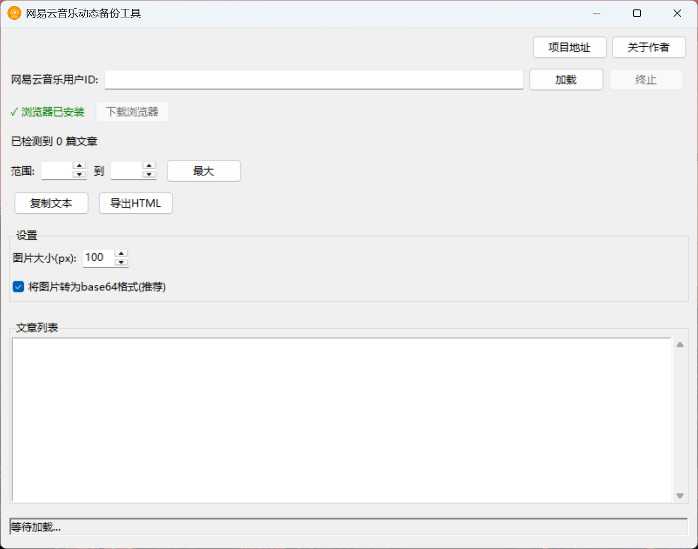

# 网易云音乐笔记(个人动态)备份工具

## 📝 简介

网易云音乐笔记(个人动态)备份工具是一款轻量级应用，用于备份网易云音乐用户的动态内容。提取用户发布的文字、图片和分享的音乐信息，将这些内容保存为 HTML 或纯文本格式，方便用户本地存档和查看。
这款工具专注于单一功能 —— 高效、完整地备份网易云音乐的用户动态，不依赖任何网易云官方 API，完全基于公开网页内容进行爬取。

## ✨ 主要特性

### 内容提取

- **文本内容**：保留原始文本格式，包括换行和基本样式
- **图片资源**：提取高质量图片，支持查看大图
- **音乐信息**：保存分享的歌曲和歌手信息及链接
- **发布时间**：记录每条动态的发布时间

### 导出选项

- **HTML 导出**：
  - 生成包含原始样式的 HTML 页面
  - 集成图片查看器，支持点击放大
  - 可选择嵌入 Base64 图片或使用原始链接
- **文本复制**：快速复制为纯文本格式，方便分享

---

## ⚠️ 使用说明

本项目提供两种使用方式：

1. **油猴脚本版本**：可备份包括私密(未公开)在内的所有个人动态，需要先登录网页版网易云
2. **独立应用版本**：只能备份公开的动态内容，无需登录

### 安装 Tampermonkey（油猴脚本必需）

在使用油猴脚本之前，你需要先安装 Tampermonkey 浏览器扩展：

- Chrome：[Chrome 网上应用店](https://chromewebstore.google.com/detail/tampermonkey/dhdgffkkebhmkfjojejmpbldmpobfkfo)
- Edge：[Microsoft Edge 加载项](https://microsoftedge.microsoft.com/addons/detail/tampermonkey/iikmkjmpaadaobahmlepeloendndfphd)

开启浏览器的开发者模式：

1. Chrome: 访问 `chrome://extensions/`  
   Edge: 访问 `edge://extensions/`
2. 在右上角或左侧找到并开启"Developer mode"（开发者模式）开关

### 获取网易云音乐用户 ID

1. 打开网易云音乐 APP
2. 点击底部"我的" ⟶ 点击右上角菜单按钮 ⚙️
3. 点击"分享" ⟶ "复制链接"
4. 粘贴到记事本，链接中的数字部分即为用户 ID

### 使用方式

**油猴脚本版本**：

- 安装脚本, 请点击[安装](https://raw.githubusercontent.com/sansan0/netease-note-backup/master/netease-note-backup.user.js)

- 安装脚本后访问 `https://music.163.com/#/user/event?id=你的用户ID`

- 登录后即可备份私密动态

**独立应用版本**：

- 点击 [下载](https://github.com/sansan0/netease-note-backup/releases)，下载最新的 NetEaseNoteBackup.zip 压缩包解压到电脑本地，运行应用后，点击下载浏览器，输入用户 ID（仅支持备份公开动态），点击加载即可



## 💡 使用指南

### 基本使用流程

1. **输入用户 ID**：
   - 在顶部输入框中输入网易云音乐用户 ID（纯数字）
   - 点击"加载"按钮开始爬取
2. **等待爬取完成**：
   - 程序会自动滚动页面加载更多内容
   - 状态栏显示当前爬取状态和进度
   - 如需提前结束，可点击"终止"按钮
3. **导出内容**：
   - 设置要导出的动态范围（默认全部）
   - 选择导出格式（HTML 或纯文本）
   - 点击相应按钮执行导出操作

### 导出 HTML 技巧

HTML 导出提供更丰富的功能：

1. **图片处理选项**：
   - 勾选"将图片转为 base64 格式"可使 HTML 文件完全离线，但文件体积更大
   - 不勾选则使用原始图片链接，文件更小但需网络连接查看图片
2. **调整图片大小**：
   - 使用"图片大小(px)"设置导出 HTML 中的缩略图大小
   - 点击图片仍可查看原始大小
3. **保存位置**：
   - 点击"导出 HTML"后选择保存位置和文件名
   - HTML 文件可在任何现代浏览器中查看

## 🔧 安装与运行

### 环境要求

- Python 3.9+
- Poetry 包管理工具
- Playwright 浏览器驱动

### 从源码安装

```bash
git clone https://github.com/sansan0/netease-note-backup.git
cd netease-note-backup
poetry install
poetry run playwright install chromium
```

### 运行应用

```bash
poetry run netease_note_backup
```

## ⚙️ 配置选项

### 图片设置

- **图片大小**：调整导出 HTML 中的缩略图大小（50-500 像素）
- **Base64 选项**：选择是否将图片转换为 Base64 格式嵌入 HTML

### 导出范围

- **范围选择**：设置起始和结束序号，选择部分动态导出
- **最大范围**：一键设置为导出所有已爬取动态

## 📄 许可证

本项目采用 GPL-3.0 许可证 - 详见 [LICENSE](LICENSE) 文件
